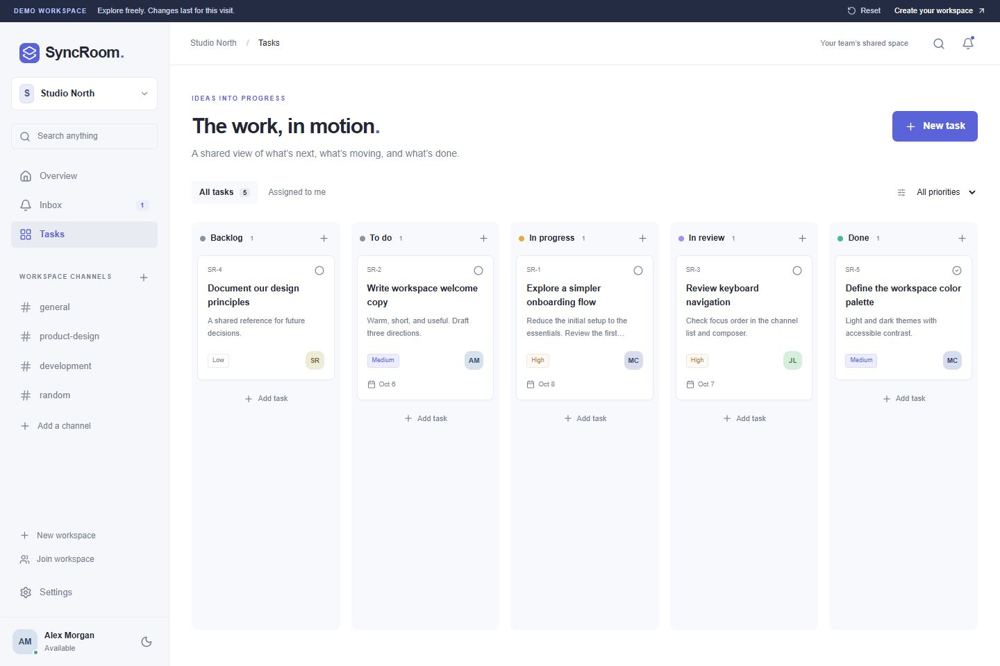

# SyncRoom

**Real-Time Team Collaboration** — a shared workspace for conversations, tasks, files, and the people behind them.

## Explore

Run locally and visit `/demo` for an interactive, populated workspace. No account, backend, payment, or credit card is needed for the demo. Its data is isolated in `src/lib/demo.ts`; edits last for the current page session and Reset restores the starting state. Demo participants do not simulate live activity. Live workspaces use `/app`.

## Features

- Email/password authentication, cookie sessions, protected workspace entry, and password recovery flow.
- Workspace creation and switching; single-use, expiring invite links; owner/admin/member permissions.
- Public channels with live messages, editing, deletion, reply references, reactions, mentions, presence, and throttled typing broadcasts.
- Private image/document uploads with size/type limits, signed download links, and image previews.
- In-app mention, reply, and assignment notifications with read state.
- PostgreSQL message search plus channel/member search.
- Five-column task board with assignment, due dates, priorities, filters, and status editing.
- Workspace overview, profile and workspace settings, light/dark themes, keyboard-accessible dialogs, mobile navigation, empty/loading/error states.

## Screenshots



[Dark chat screenshot](docs/screenshots/chat-dark.jpg). These are captures of the actual local demo. The landing-page preview is illustrative; the `/demo` workspace is interactive.

## Stack and structure

Next.js 16 App Router, React 19, strict TypeScript, Tailwind CSS 4, shadcn-style local UI primitives built on Radix, Lucide, React Hook Form, Zod, and Supabase (PostgreSQL, Auth, Realtime, Storage). The lockfile pins the resolved compatible versions. Direct packages use MIT, Apache-2.0, or ISC licenses.

```text
src/app/                   Server routes, authentication callback, public pages
src/components/ui/         Shared accessible primitives
src/components/workspace/  Chat, task board, search, overview, settings
src/hooks/                 Live workspace state and signed asset URLs
src/lib/                   Domain types, validation, demo fixtures, Supabase clients
supabase/migrations/       Schema, policies, triggers, and transactional RPCs
tests/                     Validation and executable database authorization tests
```

The landing page and route entry points are Server Components. Stateful collaboration views are Client Components. Supabase queries carry the authenticated user's session; database policies are the authorization boundary. Realtime subscriptions are cleaned up on workspace/channel changes. Message history loads in batches of 50; typing expires without database writes. Focus and a 30-second reconciliation timer recover missed changes. Mutations wait for acknowledgement and retain drafts after failure.

## Local setup

Use Node.js 22.13+ or 24 LTS and npm.

```sh
npm ci
npm run dev
```

Open `http://127.0.0.1:3000`. The landing page and `/demo` run without environment variables.

For live workspaces, copy `.env.example` to `.env.local` and fill in:

| Variable                               | Value                                                       |
| -------------------------------------- | ----------------------------------------------------------- |
| `NEXT_PUBLIC_SUPABASE_URL`             | Your project's API URL                                      |
| `NEXT_PUBLIC_SUPABASE_PUBLISHABLE_KEY` | Your project's publishable key (legacy anon key also works) |

These two values are intended for the browser. Never use a secret or service-role key. `.env.local` is ignored by Git.

## Supabase setup — Free plan

1. Create a **Free** project in a Free organization. No paid add-ons are used.
2. Run `supabase/migrations/001_syncroom.sql` once in the SQL Editor on a **fresh project**. The migration creates tables, indexes, RLS policies, a private `workspace-files` bucket, and the Realtime publication entries. It changes public-schema grants, so do not run it against an unrelated existing application's database.
3. In Authentication → URL Configuration, set your site URL and allow `http://127.0.0.1:3000/auth/callback` and your deployed `/auth/callback` URL. Include callback query strings as required by the dashboard's redirect matching rules.
4. Keep email/password authentication enabled. For a no-email test environment, create two confirmed test users from the Supabase dashboard; sign in from separate browser sessions. This requires no SMTP service.
5. Public email confirmation and reset delivery are **not guaranteed by the default sender**: Supabase restricts it to project-team addresses and rate-limits it. No paid mail provider is bundled or required for the recruiter demo. An isolated demo project can allow signup without email confirmation, but those email addresses are unverified and password recovery still needs email delivery. The app handles either confirmation setting. Preserve verified-email requirements for real users.
6. Restart the app after adding the environment variables. Sign in, create a workspace, then generate a single-use invite from Settings → Members and accept it in the other session.

Use the isolated browser demo to populate recruiter walkthroughs. Live projects begin empty except for their `general` channel; no fictional accounts or metrics are inserted into production.

## Database and authorization

`profiles`, `workspaces`, `workspace_members`, `channels`, `messages`, `message_reactions`, `message_attachments`, `tasks`, `notifications`, and `workspace_invites` form the normalized model. Workspace deletion cascades through its content; reply references become null if their parent is deleted. Removing members clears their task assignments while preserving conversation authorship.

- All application tables have RLS. Anonymous requests cannot read live workspace data.
- Security-definer membership helpers prevent recursive RLS checks and use an empty search path. RPC execution is restricted to authenticated users.
- Workspace creation and invite acceptance run transactionally. Invite tokens are random, stored as SHA-256 hashes, expire after seven days, and lock during redemption.
- Column-level grants prevent author impersonation and moving messages, channels, or tasks into another workspace.
- Only message authors can edit text; authors and admins can delete. Only owners manage admin roles, and owners cannot remove themselves.
- Replies must reference their own channel; task assignees must belong to the workspace; duplicate reactions have a composite primary key.
- Notification triggers run in the database. Users can only read their own inbox and update its read timestamp.
- Private Storage paths include workspace and uploader IDs. Bucket MIME/size constraints complement client validation. Signed URLs expire in five minutes and refresh while the view is open. Existing signed links remain valid until expiration even after membership removal.
- Private Presence/Broadcast topics require workspace membership. Presence and typing are ephemeral UX hints, not proof of identity or authorization.

## Verification

```sh
npm run typecheck
npm run lint
npm test
npm run build
npm start
```

The database test executes the migration against PGlite PostgreSQL with Supabase-schema fixtures and role switching. It checks workspace isolation, column permissions, author editing, role escalation, invite reuse, reactions, assignment validation, notification privacy, private topic authorization, file access, and membership revocation. Test-only crypto shims cover invitation control flow, not cryptographic entropy. Hosted Auth, WebSocket delivery, email, and Storage HTTP still need the two-account integration walkthrough against your configured Supabase project.

## Free deployment

Import this repository into a **personal Vercel Hobby** account, use the Next.js preset, add the two environment variables, and deploy. Use the included `vercel.app` address; a purchased domain is unnecessary. Update Supabase's allowed callback URL afterward. No paid analytics, image transformation service, notification provider, or deployment add-on is required. `npm run build` also produces a standard self-hostable Next.js application.

For a recruiter link that works even when the backend is paused, link directly to `/demo`. The demo never contacts Supabase. It is a single-browser showcase, not a shared multi-user session.

Free plan limits checked **October 3, 2026**: Supabase includes a 500 MB database, 1 GB file storage, 50,000 monthly active users, 200 concurrent Realtime connections, and 2 million monthly Realtime messages. Free projects can pause after a week of inactivity. Vercel Hobby is for personal, non-commercial use and has usage caps. Stay on the Free/Hobby plans and reduce usage or restore a paused project instead of upgrading. Limits may change; consult [Supabase pricing](https://supabase.com/pricing), [Supabase email restrictions](https://supabase.com/docs/guides/auth/auth-smtp), and [Vercel Hobby](https://vercel.com/docs/plans/hobby).

## Current boundaries and next steps

- No DMs, private channels, full threaded panels, drag-and-drop, ownership transfer, email/push notifications, or notification preferences. Task status changes use an accessible form; replies reference their parent message.
- Search returns up to 30 messages using English full-text search; the demo uses substring matching. Inbox loads the latest 100 notifications. Tasks/members target small portfolio teams.
- Upload checks enforce MIME and size, not malware scanning. Deleted channels or admin-deleted messages can leave orphaned Storage objects; review unused files from the dashboard to preserve the free storage quota. Workspace-scoped avatar files may become unavailable after leaving their originating workspace.
- Concurrency uses last-write-wins editing. Large-team pagination, conflict resolution, storage cleanup jobs, and abuse quotas are future improvements.
- No hosted deployment or external integration result is claimed before a configured project is tested.
